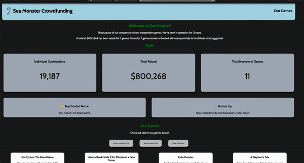

# WEB102 Prework - *GoodFund*

Submitted by: **Akil Adnan Bhuiyan**

**GoodFund** is a website for the company Sea Monster Crowdfunding that displays information about the games they have funded.

Time spent: **18** hours spent in total

## Required Features

The following **required** functionality is completed:

* [x] The introduction section explains the background of the company and how many games remain unfunded.
* [x] The Stats section includes information about the total contributions and dollars raised as well as the top two most funded games.
* [x] The Our Games section initially displays all games funded by Sea Monster Crowdfunding
* [x] The Our Games section has three buttons that allow the user to display only unfunded games, only funded games, or all games.

The following **optional** features are implemented:

* [x] List anything else that you can get done to improve the app functionality!

## Video Walkthrough

Here's a walkthrough of implemented features:

## Notes

Creating, adding, implementing functionality and design was very straigtforward. Its definitely refreshed my memory of html, css and js. I had to research about filter and reduce methods, but afterward I realized the benefits of it, which make the website more efficient. In this prework, I learned JavaScript features such as template literals, functions, filter, map, reduce, destructuring and spread operators, logic evaluation. 

## License

    Copyright [2023] [Akil Adnan Bhuiyan]

    Licensed under the Apache License, Version 2.0 (the "License");
    you may not use this file except in compliance with the License.
    You may obtain a copy of the License at

        http://www.apache.org/licenses/LICENSE-2.0

    Unless required by applicable law or agreed to in writing, software
    distributed under the License is distributed on an "AS IS" BASIS,
    WITHOUT WARRANTIES OR CONDITIONS OF ANY KIND, either express or implied.
    See the License for the specific language governing permissions and
    limitations under the License.
